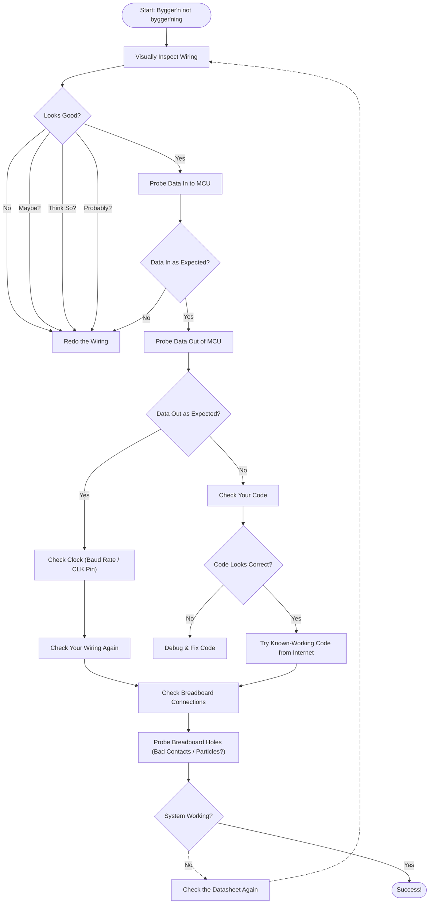

# TTK4155 Embedded computer Project

Repo containing code and infrastructure for building the semester project in the NTNU subject TTK4155 Embedded and Industrial Computer Systems Design

## Useful notes to self

### Commands

- Picocom (use tab-completion for the serial device):
  `picocom /dev/<SERIAL_DEVICE> --baud 9600 --parity n --databits 8 --stopbits 2`

  The shortened version
  `picocom /dev/<SERIAL_DEVICE> -b 9600 -y n -d 8 -p 2`

## Issues encountered and their solution

### USART flipping bits in the RS232 line driver

We were sending the letter 'k' but recieving 'J'. Using a scope on the TX
output of the uC showed the correct databits, but after the MAX233 we were
reading something else.

**The solution**

We were setting the wrong baud rate and the synchronisation issues revealed
themselves later down the chain of components. Turns out, you should set both
UBRRH and UBRRL regardless of the size of the UBRR number.

### Half the addresses on the RAM getting overwritten

While all our addresses were passing the write test, half were failing on read.
We figured it might be caused by a single bit not flipping and thus the addresses
using the faulty bit were being overwritten. Tried using known good code, redid
the wiring a dozen times, stuck decoupling caps _everywhere_ and swapped out both
the latch and uC, all to no avail.

We probed again and noticed a single bit not latching. While all other outputs on
the latch were switching between 0V and 3.5V (nominal according to the datasheet),
the faulty one switched between 3.5v and 5v, leading to reading a constant logic
high. Strange considering this was our sixth latch so the odds of it being faulty
were astronomically small.

**The solution**

One of the breadboard holes between the uC and had a small particle stuck inside.
While the contacts for both the uC and latch were good, this particle likely
shorted two paths causing noise and undefined behaviour. Angrily stabbing the 
offending hole with a dupont wire fixed the issue.

## Debugging flowchart - expanded as we encounter more problems

