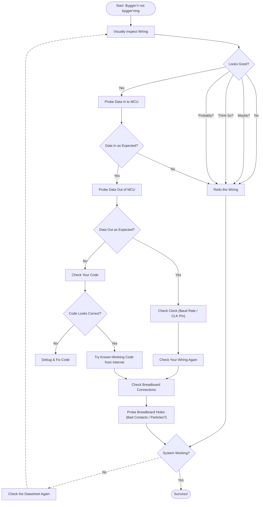

# TTK4155 Embedded computer Project

<!--toc:start-->

- [TTK4155 Embedded computer Project](#ttk4155-embedded-computer-project)
  - [Useful notes to self](#useful-notes-to-self)
    - [Commands](#commands)
  - [Issues encountered and their solution](#issues-encountered-and-their-solution)
    - [2.1 USART flipping bits in the RS232 line driver](#21-usart-flipping-bits-in-the-rs232-line-driver)
      - [2.1.1 **The solution**](#211-the-solution)
    - [2.2 Half the addresses on the RAM getting overwritten](#22-half-the-addresses-on-the-ram-getting-overwritten)
      - [2.2.1 **The solution**](#221-the-solution)
    - [2.3 SPI only sending a single (if lucky) packet](#23-spi-only-sending-a-single-if-lucky-packet)
      - [2.3.1 **The solution**](#231-the-solution)
    - [2.4 Delay not timing correctly when using different crystal](#24-delay-not-timing-correctly-when-using-different-crystal)
      - [2.4.1 **The solution**](#241-the-solution)
    - [2.5 CAN init freezing halfway through](#25-can-init-freezing-halfway-through)
      - [2.5.1 **The solution**](#251-the-solution)
    - [2.6 CAN freezing in loopback](#26-can-freezing-in-loopback)
      - [2.6.1 **The solution**](#261-the-solution)
    - [2.7 CAN only receiving overload frames in normal mode](#27-can-only-receiving-overload-frames-in-normal-mode)
      - [2.7.1 **The solution**](#271-the-solution)
    - [2.8 Node 2 only receiving a fraction of frames](#28-node-2-only-receiving-a-fraction-of-frames)
      - [2.8.1 **The solution**](#281-the-solution)
    - [2.9 Node 2 PWM unstable](#29-node-2-pwm-unstable)
      - [2.9.1 **The solution**](#291-the-solution)
    - [2.10 Encoder only writing 0](#210-encoder-only-writing-0)
      - [2.10.1 **The solution**](#2101-the-solution)
    - [2.11 Node 1 randomly crashing and freezing](#211-node-1-randomly-crashing-and-freezing)
      - [2.11.1 **The solution**](#2111-the-solution)
  - [Debugging flowchart - expanded as we encounter more problems](#debugging-flowchart-expanded-as-we-encounter-more-problems)
  <!--toc:end-->

Repo containing code and infrastructure for building the semester project in the NTNU subject TTK4155 Embedded and Industrial Computer Systems Design

## Useful notes to self

### Commands

- Picocom (use tab-completion for the serial device):
  `picocom /dev/<SERIAL_DEVICE> --baud 9600 --parity n --databits 8 --stopbits 1`

  The shortened version
  `picocom /dev/<SERIAL_DEVICE> -b 9600 -y n -d 8 -p 1`

## Issues encountered and their solution

### 2.1 USART flipping bits in the RS232 line driver

We were sending the letter 'k' but recieving 'J'. Using a scope on the TX
output of the uC showed the correct databits, but after the MAX233 we were
reading something else.

#### 2.1.1 **The solution**

We were setting the wrong baud rate and the synchronisation issues revealed
themselves later down the chain of components. Turns out, you should set both
UBRRH and UBRRL regardless of the size of the UBRR number.

### 2.2 Half the addresses on the RAM getting overwritten

While all our addresses were passing the write test, half were failing on read.
We figured it might be caused by a single bit not flipping and thus the addresses
using the faulty bit were being overwritten. Tried using known good code, redid
the wiring a dozen times, stuck decoupling caps _everywhere_ and swapped out both
the latch and uC, all to no avail.

We probed again and noticed a single bit not latching. While all other outputs on
the latch were switching between 0V and 3.5V (nominal according to the datasheet),
the faulty one switched between 3.5v and 5v, leading to reading a constant logic
high. Strange considering this was our sixth latch so the odds of it being faulty
were astronomically small.

#### 2.2.1 **The solution**

One of the breadboard holes between the uC and had a small particle stuck inside.
While the contacts for both the uC and latch were good, this particle likely
shorted two paths causing noise and undefined behaviour. Angrily stabbing the
offending hole with a dupont wire fixed the issue.

### 2.3 SPI only sending a single (if lucky) packet

Our early attempts at getting SPI up and running were met with a single packet read
on the oscilloscope, before code execution got stuck in the SPI transmission
done loop.

#### 2.3.1 **The solution**

As the uC supports slave mode as well, it features a SS pin. If triggered, the uC
will automatically enter slave mode, regardless of register config. In order to avoid
accidentally pulling the wrong logic on this, it can either be pulled HIGH or explicitly
defined as output. The latter allows us to keep using the pin as a output, hence
proving the better solution.

### 2.4 Delay not timing correctly when using different crystal

While this lab is based around a 4.915200MHz crystal, there was an attempt at using
a 16MHz crystal as well. After adjusting the fuses to support an 8+MHz external clock
the code was acting strange. A delay was only lasting an eighth of the time passed
to the function. Setting the clock-divider fuse solved it, but caused issues for
the UART baudrate.

#### 2.4.1 **The solution**

The `delay` library has a software defined macro `F_CPU` defining the clock
speed. We´ve been lucky this is compatible with our usual clock, but now it had
to be defined from the compiler. Adding `-DF_CPU=<clock>` to the compilation
command solved it (see commit `#7f15e61`).

### 2.5 CAN init freezing halfway through

Halfway through initialising the CAN controller, the entire MCU froze. Upon
probing the SPI connection to the controller, the clock line seemed to stop at
arbitrary points while MOSI was still transmitting.

#### 2.5.1 **The solution**

The `spi_write_n` was causing problems. It implicitly passes `NULL` as the
output buffer and trashes whatever the SPI device responds with when sending.
When sending n bytes, the function indexes into the output buffer in order to
store the data. Indexing past NULL-ptr accesses and overwrites important system-
memory and causes undefined behaviour. This is equivalent to a segmentation
fault on an operating system and was fixed by only writing the output buffer if
not NULL.

### 2.6 CAN freezing in loopback

When first implementing CAN on node 1 we had problems with the TX-buffer filling.
After sending one message it froze and reported full buffer.

#### 2.6.1 **The solution**

We forgot to read the CAN frame we were sending...

### 2.7 CAN only receiving overload frames in normal mode

After switching from loopback to normal mode we were finally reading messages on
the TX-bus. The messages however, were all overload frames.

#### 2.7.1 **The solution**

CAN-bus is a network and requires at least two nodes to acknowledge eachother's messages.

### 2.8 Node 2 only receiving a fraction of frames

We were sending frames about 6.5 times a second from Node 1. Node 2, however was
only receiving one every 5 seconds. We verified the connection, and with an
oscilloscope we noticed most of the frames got NACK.

#### 2.8.1 **The solution**

When testing the driver we implemented both polling and interrupt CAN. Turns
out, these interfere with each other and cause problems in the long run.
Switching to interrupt only solved the problem.

### 2.9 Node 2 PWM unstable

After getting the PWM up and running the duty-cycle was inverted. Not thinking
twice we inverted the result of the equation and went on our merry way. When
integrating the motor, the PWM signal was acting up whenever we switched the
duty-cycle to something other than alternating between two values. Changing the
period was especially troublesome. It went as far so as to act differently
depending on flashed, when we flashed and what the Arduino had for dinner
the night before.

#### 2.9.1 **The solution**

When setting the DTY and PRD we were, out of habit, OR-ing the registers. This
is obvious in hindsight, but means our values would be OR-ed together with
whatever garbage is in the registers when initialised. Changing this to regular
`=` solved the problems.

### 2.10 Encoder only writing 0

The motor encoder was only reading 0, despite manual movement of the motor.

#### 2.10.1 **The solution**

We were writing to the wrong register, thus setting the incorrect clock speed.

### 2.11 Node 1 randomly crashing and freezing

We had persistent issues with node 1 crashing and freezing at inconvenient
places. At first it seemed to be an issues with the CAN driver, as the node
worked when removing CAN. However, when adding LOG statements to figure it out,
the same problem arose.

#### 2.11.1 **The solution**

By chance we noticed the memory section in Microchip Studio. This reported 98%
data memory and 30-something% program memory. As most of the group were flashing
using `avr-gcc` and `avrdude` we configured the `makefile` to run `avr-size` on
the binary after each flash. Sure enough, we had completely filled the internal
memory of the MCU. Of course, we could add a linker script for mapping the
external SRAM and assign an attribute to some of the larger structs and buffers.
Instead, however, we opted to buffer most of the already known strings used by
our logging module to the PROGMEM. This freed up most of our memory and we're
now diligently keeping and eye on the ram of our controller.

## Debugging flowchart - expanded as we encounter more problems

```mermaid
flowchart TD
    A(["Start: Bygger'n not bygger'ning"]) --> B["Visually Inspect Wiring"]
    B --> C{"Looks Good?"}
    C -->|No| D["Redo the Wiring"]
    C -->|Maybe?| D
    C -->|Think So?| D
    C -->|Probably?| D
    D --> P

    C -->|Yes| E["Probe Data In to MCU"]
    E --> F{"Data In as Expected?"}
    F -->|No| D
    F -->|Yes| G["Probe Data Out of MCU"]

    G --> H{"Data Out as Expected?"}
    H -->|No| I["Check Your Code"]
    H -->|Yes| CLK["Check Clock (Baud Rate / CLK Pin)"]

    CLK --> J["Check Your Wiring Again"]

    I --> K{"Code Looks Correct?"}
    K -->|No| L["Debug & Fix Code"]
    K -->|Yes| M["Try Known-Working Code from Internet"]

    J --> N["Check Breadboard Connections"]
    M --> N
    N --> O["Probe Breadboard Holes (Bad Contacts / Particles?)"]
    O --> P{"System Working?"}
    P e1@-->|No|R["Check the Datasheet Again"] e2@--> B
     e1@{ animate: true }
     e2@{ animate: true }
    P -->|Yes| Q(["Success!"])
```
